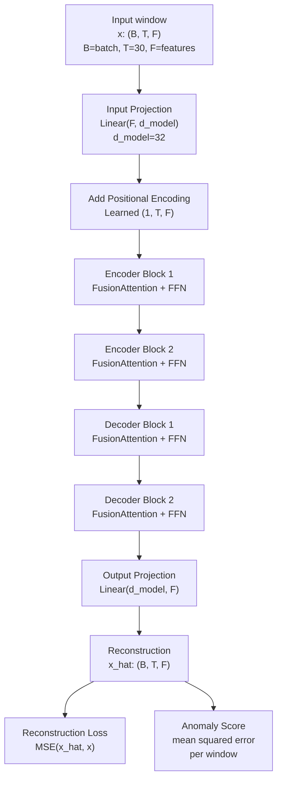
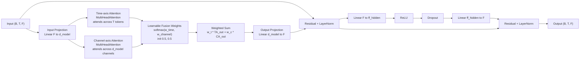
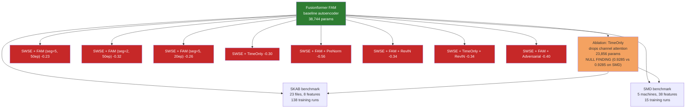
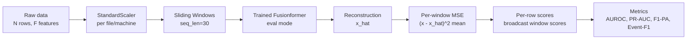

# Model architecture reference

Diagrams for the dissertation writeup. Convert to PNG via mermaid CLI or use
online at https://mermaid.live.

## 1. Full Fusionformer autoencoder pipeline

Reconstruction-based anomaly detection setup. Input window is passed through
input projection → positional encoding → N encoder blocks → N decoder blocks
→ output projection → reconstruction. Anomaly score = mean squared error
between input and reconstruction.



## 2. FusionAttention block detail

The paper's key innovation: dual-axis attention combining time-axis and
channel-axis attention with a learnable fusion weight. Post-norm transformer
block with residual connections.



## 3. Variant tree — all models tested

Baseline Fusionformer FAM was tested against a TimeOnly ablation (null result
on both SKAB and SMD) and against 8 SWSE configurations (all failed).



## 4. Data flow — inference pipeline

For anomaly scoring at inference time.



## Rendering

**Fastest**: paste any code block above into https://mermaid.live

**To PNG for dissertation**:

```bash
# Install once
npm install -g @mermaid-js/mermaid-cli

# Convert this whole file to individual PNGs
mmdc -i notes/model_architecture.md -o figures/architecture.png
```

**In VS Code**: install "Markdown Preview Mermaid Support" extension, then Cmd+K V to preview.
